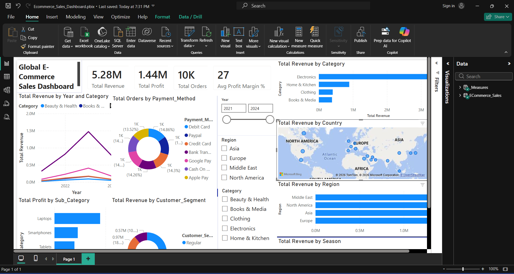

# 🛒 Global E-Commerce Sales Dashboard

## 📊 Project Overview
An interactive Power BI dashboard analysing global e-commerce 
sales performance across 4 years (2021–2024) covering revenue, 
profit, customer segments, regional performance and seasonal trends.

## 📁 Dataset
- **Source:** Kaggle
- **Records:** 10,001 rows | 26 columns
- **Coverage:** Global markets | 2021–2024

## 🔑 Key KPIs
| Metric | Value |
|---|---|
| 💰 Total Revenue | $5.28M |
| 📈 Total Profit | $1.44M |
| 📦 Total Orders | 10,001 |
| 📊 Avg Profit Margin | 27% |

## 📈 Visuals Built (12 Visuals)
1. 📈 Revenue Trend Line Chart (2021–2024)
2. 📊 Revenue by Category Bar Chart
3. 🏆 Top 5 Sub-Categories by Profit
4. 🗺️ Revenue by Country Map
5. 🍩 Revenue by Customer Segment Donut Chart
6. 🍩 Orders by Payment Method Donut Chart
7. 📊 Revenue by Region Bar Chart
8. 📈 Revenue by Season Column Chart
9. 💰 Total Revenue KPI Card
10. 📈 Total Profit KPI Card
11. 📦 Total Orders KPI Card
12. 📊 Avg Profit Margin % KPI Card

## 🧮 DAX Measures (8 Measures)
- Total Revenue
- Total Profit
- Total Orders
- Total Quantity Sold
- Avg Profit Margin %
- Avg Discount %
- Avg Shipping Days
- YoY Revenue Growth %

## 🎛️ Interactive Slicers
- 📅 Year (2021–2024)
- 🌍 Region
- 📦 Category
- ✅ Order Status

## 🛠️ Tools Used
- **Power BI Desktop** — Dashboard building
- **Power Query** — Data cleaning & transformation
- **DAX** — 8 custom measures
- **Kaggle** — Dataset source

## 🔗 Live Portfolio
[🌐 View My Portfolio](https://vijayhgv.github.io)
